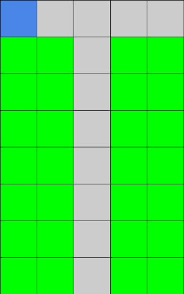
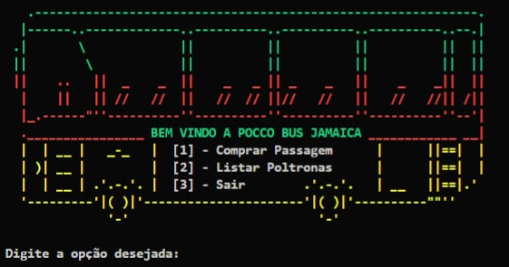
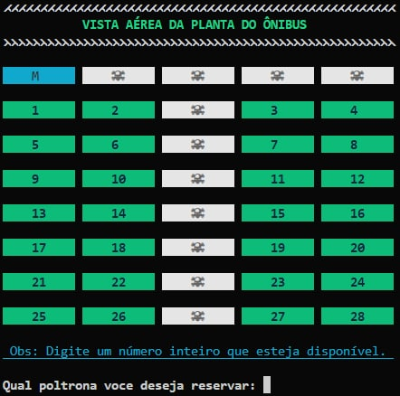
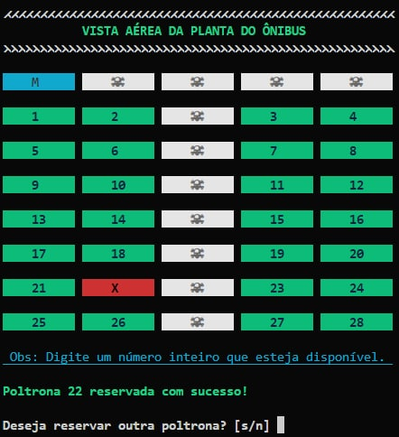
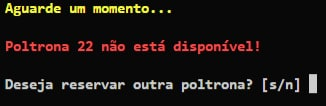
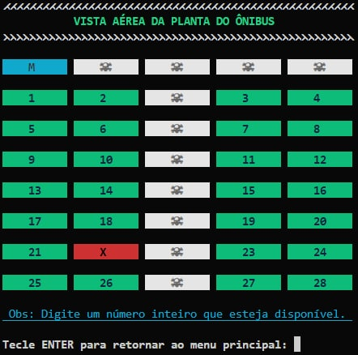
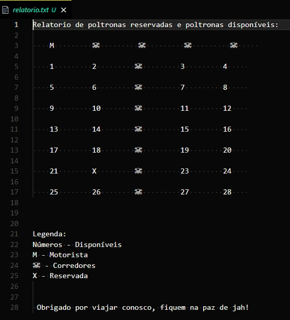

<h1> Python-Bus </h1>
<h3>Projeto criado em um laboratório de Python, dentro do BlueAcademy.</h3>

A PoccoBus, empresa que faz parte da holding Pocco In, é uma das maiores empresas de transporte terrestres do país. Mesmo com muito dinheiro o sistema de venda de passagens de ônibus é arcaico e praticamente todo manual. A diretora de operações da PoccoBus, Toni Collette, nos contratou para desenvolver um sistema de venda novo usando Python. Ela compartilhou a visão dos assentos e as orientações sobre quais espaços devem estar a venda para que possamos nos basear durante o desenvolvimento do algoritmo. 
  
<strong>Visão dos assentos:</strong>

<ul><li>Azul: Assento do motorista</li>

<li>Cinza: Corredor e parte da frente do ônibus</li>

<li>Verde: Assentos disponíveis para compra</li></ul>

   

<strong>To do:</strong>
<ul><li>Desenvolva um algoritmo que possibilite a venda dos assentos em verde. Toda vez que um assento for vendido o algoritmo deverá atualizar a matriz para que na próxima venda ele não apareça como disponível. Não esqueça tratar inserções de valores incorretos ou de assentos não disponíveis para que o fluxo não seja interrompido. Ao final do exercício o algoritmo deverá gerar um arquivo txt com a relação de todos os assentos vendidos e disponíveis.</li></ul>
 

<h3>Documentação</h3>

O projeto foi desenvolvido na linguagem de programação Python, utilizando funções, dicionário, listas, tópicos básicos da linguagem como um todo e bibliotecas(os system, time sleep), feito em apenas um arquivo de forma procedural, afim de estimular conhecimento e aprendizado... Utilizei cores já que o programa roda diretamente no console, ao final do programa é gerado um txt com um relatório em matriz do ônibus com a relação de poltronas ocupadas e disponíveis.
 

<h3>Prints do projeto concluído:</h3>

<h4>Menu de opções</h4>

 

<h4>Matriz do ônibus<h4>

 
  
<h4>Poltrona reservada<h4>

 

<h4>Poltrona indisponível<h4>

 
  
<h4>Ver poltronas reservadas<h4>

 
  
<h4>Relatório de reservas txt<h4>

   
  

Lembrando isso é um projeto piloto, tem muitas melhorias a serem feitas e foi desenvolvido afim de praticar a linguagem Python.

Até breve....👋🏻
